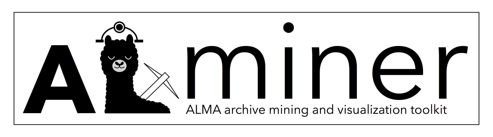

[](https://alminer.readthedocs.io/en/latest/?badge=latest)

# ALminer: ALMA Archive Mining & Visualization Toolkit

`alminer` is a Python-based code to effectively query, analyse, and visualize the [ALMA science archive](https://almascience.eso.org/aq/). It also allows users to directly download ALMA data products and/or raw data for further image processing.

## Installation

The easiest way to install `alminer` is with `pip`:

```pip install alminer```

To obtain the most recent version of the code from Github:

```pip install https://github.com/emerge-erc/ALminer/archive/refs/heads/main.zip```

Or clone and install from source:
```
# If you have a Github account:
git clone git@github.com:emerge-erc/ALminer.git
# If you do not:
git clone https://github.com/emerge-erc/ALminer.git

# After cloning:
cd ALminer
pip install .
```

Note that depending on your setup, you may need to use pip3.

### Dependencies

The dependencies are `numpy`, `matplotlib`, [`pandas`](https://pandas.pydata.org/), [`pyvo`](https://pyvo.readthedocs.io/en/latest/), [`astropy`](https://www.astropy.org/) version 3.1.2 or higher, and [`astroquery`](https://astroquery.readthedocs.io/en/latest/) version 0.4.2.dev6649 or higher. We only use the `astroquery` package for downloading data from the ALMA archive. The strict requirement to have its newest version is due to recent changes made to the ALMA archive. `alminer` works in Python 3. 


## Getting started

We have created an extensive [tutorial Jupyter Notebook](https://nbviewer.jupyter.org/github/emerge-erc/ALminer/blob/main/notebooks/tutorial/ALminer_tutorial.ipynb?flush_cache=True) where all `alminer` features have been highlighted. This is an excellent starting point to get familiar with all the possibilities; a glossery of all functions is provided at the bottom of this notebook. 

|  To work with the tutorial notebook interactively [](https://mybinder.org/v2/gh/emerge-erc/ALminer/main?urlpath=/tree/notebooks/tutorial/ALminer_tutorial.ipynb) |
|------|

We highly recommend working in a [Jupyter notebook environment](https://jupyter.org/install) in order to make use of `alminer`'s visualization tools. We aim to keep adding new notebooks relevant for various sub-fields in the future.

## Documentation

More information can be found in the [documentation](https://alminer.readthedocs.io/en/latest/?badge=latest).

### What's new:

- You can now specify which archive service to query: [ESO](https://almascience.eso.org/tap) is the default, and other options are [NRAO](https://almascience.nrao.edu/tap) and [NAOJ](https://almascience.nrao.edu/tap). This option can be given through the *'tap_service'* parameter to all functions that do the query (e.g. keysearch, target, catalog). For example:
  - ```alminer.target(["TW Hya", "HL Tau"], tap_service='NRAO')```
  - Note that currently the ESO service is not returning all results, hence it is advisable to test your queries with multiple services until further notice.
- It is now possible to query entire phrases with the `keysearch` function. For example:
  - ```alminer.keysearch({'proposal_abstract': ['"high-mass star formation" outflow disk']})``` will query the proposal abstracts for the phrase *high-mass star formation* AND the words *outflow* AND *disk*.
  - ```alminer.keysearch({'proposal_abstract': ['"high-mass star formation" outflow disk', '"massive star formation" outflow disk']}) ``` will query the the proposal abstracts for the phrase *high-mass star formation* AND the words *outflow* AND *disk* OR the phrase *massive star formation* AND the words *outflow* AND *disk*.

## Acknowledgements

`alminer` has been developed through a collaboration between [Allegro](https://www.alma-allegro.nl/), the ALMA Regional Centre in The Netherlands, and the University of Vienna as part of the [EMERGE-StG project](https://emerge.alvarohacar.com). This project has received funding from the European Research Council (ERC) under the European Union’s Horizon 2020 research and innovation programme (Grant agreement No. 851435).

If you use `alminer` as part of your research, please consider citing this [ASCL article](https://ascl.net/code/v/2971) (ADS reference will be added to the Github page when available).

 `alminer` makes use of different routines in [Astropy](https://www.astropy.org/) and [Astroquery](https://astroquery.readthedocs.io/en/latest/). Please also consider citing the following papers:
- Astropy: [Astropy Collaboration et al. 2013](https://ui.adsabs.harvard.edu/abs/2013A%26A...558A..33A/abstract) <br>
- Astroquery: [Ginsburg et al. 2019](https://ui.adsabs.harvard.edu/abs/2019AJ....157...98G/abstract)

We also acknowledge the work of Leiden University M.Sc. students, Robin Mentel and David van Dop, who contributed to early versions of this work. 

## Contact us

If you encounter issues, please [open an issue](https://github.com/emerge-erc/ALminer/issues). 

If you have suggestions for improvement or would like to collaborate with us on this project, please e-mail [Aida Ahmadi](mailto:aahmadi@strw.leidenuniv.nl) and [Alvaro Hacar](mailto:alvaro.hacar@univie.ac.at).


